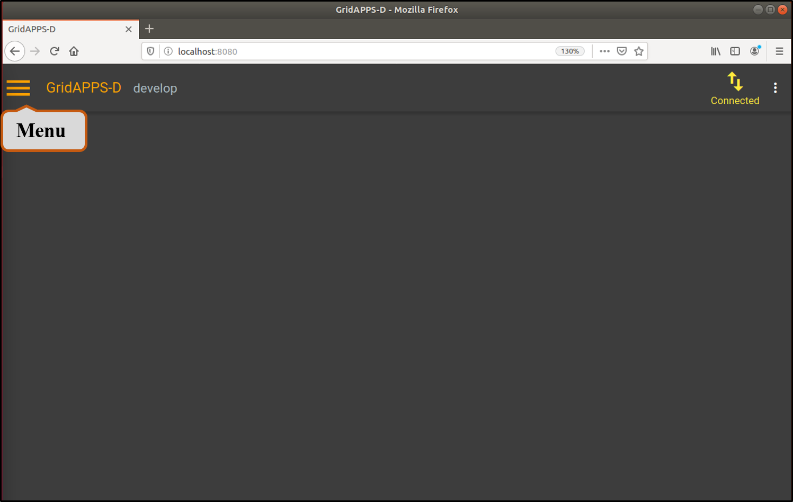
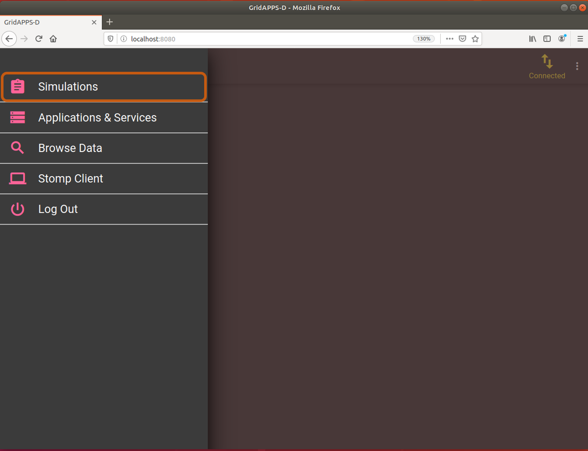
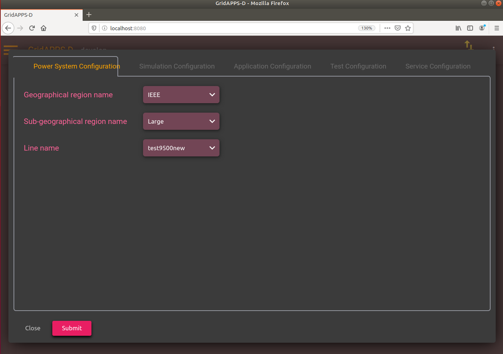
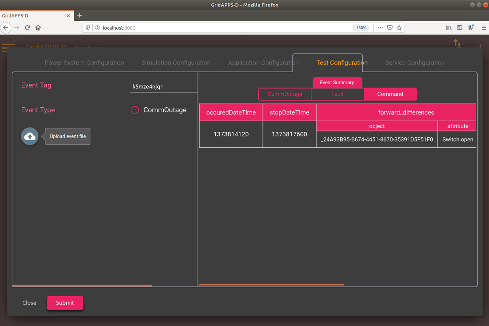
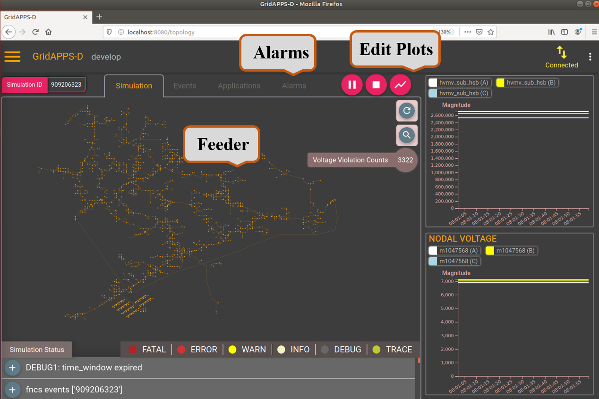

Start a Simulation
---------------------------------------

* Open your browser to http://localhost:8080/  and click the menu button.

|menu|

* Choose Simulations from the menu.

|simulations|

Change Configurations
----------------------

* Change the Power System Configuration, Simulation Configuration, Application Configuration, and Test Configuration as follows:

|psc|

|sc|

.. |sc| image:: sc.png

|ac|

.. |ac| image:: ac.png

* Communication outage and fault events can be added using the Test Configuration page as shown below. Event can be added using radio button or upload option.

|tc|

* Click the submit button to save all the configurations.

Adding an event
----------------

* Since we are running the restoration application, a fault event is required to trigger the application. Before proceeding, an event file is required. There are several ways to add event in the test feeder. Here, we use the upload option and use the following JSON file. 

.. code-block:: bash

  {
    "commandEvents": [
      {
        "message": {
          "forward_differences": [
            {
              "object": "_24A93B95-B674-4451-8670-35391D5F51F0",
              "attribute": "Switch.open",
              "value": 1
            }
          ],
          "reverse_differences": [
            {
              "object": "_24A93B95-B674-4451-8670-35391D5F51F0",
              "attribute": "Switch.open",
              "value": 0
            }
          ]
        },
        "event_type": "ScheduledCommandEvent",
        "occuredDateTime": "2013-07-14 08:02:00",
        "stopDateTime": "2013-07-14 09:00:00"
      }
    ]
  }

..

* This event opens a switch (LN0895780_SW) in the feeder at time 2013-07-14 08:02:00 and remains open until 09:00:00. Please adjust the *Start time* in Simulation Configuration based on *occuredDateTime* of the event such that event occurs after the simulation has started.

Running the platform
--------------------

* After few seconds, the test-feeder will load. In the meantime, use "Edit plots" to add power, voltage and tap of different components to visualize as the simulation progress.

* Click on the triangle to start the simulation. Once you get the Simulation_ID, use it to run the application in terminal. See the python command `here <https://gridappsd-restoration.readthedocs.io/en/latest/system_confguration/index.html#executing-the-application-container>`_.

* Note that the WSU-Restoration application gets triggered only when the fault event is added in the test case. During normal operation, application stays quite. The occurrence of the event can be verified on the Alarm tab. Once the event has occured, the applicatin starts and runs the optimization problem to generate the candidate switches for optimal circuit reconfiguration. The candidate switches are toggled and the system is restored.

|viz|

