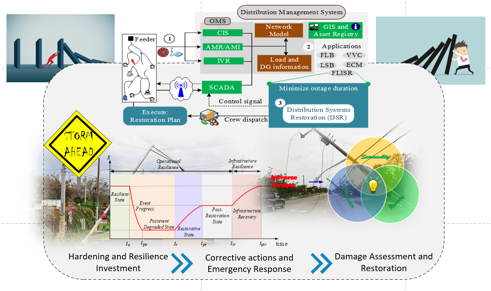

.. GridAPPS-D

==========================
WSU-Restoration Application Documentation
==========================

An advanced distribution management system (ADMS) supports grid management and decision support applications to address the growing operational challenges faced by the modern electric power distribution systems while ensuring reliable and resilient operations. In this document, we describe the development of the proposed fault location, isolation, and restoration (FLISR) and it's integration with an open-source standards-based platform for ADMS application development viz. GridAPPS-D, developed by Pacific Northwest National Laboratory (PNNL).

Essentially, an ADMS allows for applications that can readily access information from various systems including, but not limited to Distributed Energy Resource Management System (DERMS), Supervisory Control and Data Acquisition (SCADA), Outage Management Systems (OMS), Graphical Information Management Systems (GIS), and Advanced Metering Infrastructure (AMI). Recently, researchers at PNNL developed an open-source ADMS application development platform, GridAPPS-D, that provides an open-source, extensible application development environment. These new developments call for research not only on advanced applications for the distribution systems that leverage the interoperability of the ADMS platform but also on providing a proof-of-concept for integrating such advanced applications into the future ADMS.

.. toctree::
   :maxdepth: 2

   overview/index
   installing_gridappsd/index
   using_gridappsd/index
   system_confguration/index
   data_model/index
   hosted_applications/index
   api_docs/index
   license/license
     
.. |GridAPPS-D Logo| image:: GridAPPS-D_Logo.png
    :scale: 50 %
