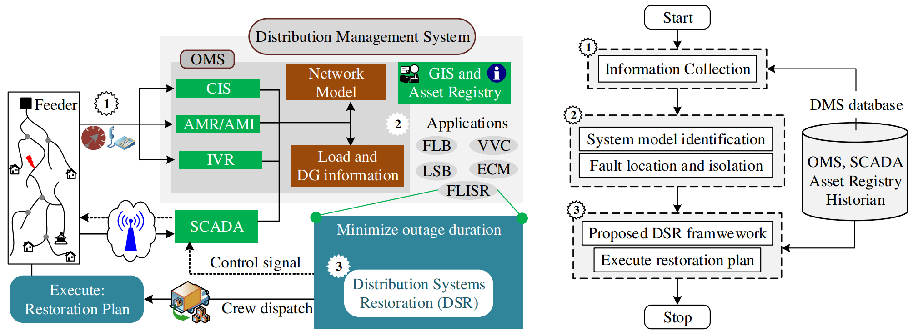

Application Architecture 
------------

The proposed restoration application can be implemented in an advanced distribution management system (ADMS) as shown in Figure 1. Figure shows the overall architecture of a modern DMS with integration of several subsystems such as customer information system (CIS), geographical information system (GIS), interactive voice response (IVR), advanced metering infrastructure (AMI), SCADA and flowchart of the proposed DSR framework. Once a power outage happens, three specific tasks are performed in the DMS to restore the power to out-of-service area:

1. **Information Collection**: To monitor the power distribution system condition and gather resource information.
2. **Information Processing**: For system model identification and fault location.
3. **Service Restoration**: To find the candidate switch and generate DER control signals for circuit reconfiguration.

|flowchart| 

*Figure 1: Architecture of a modern distribution management system and flowchart of the proposed restoration application.*

