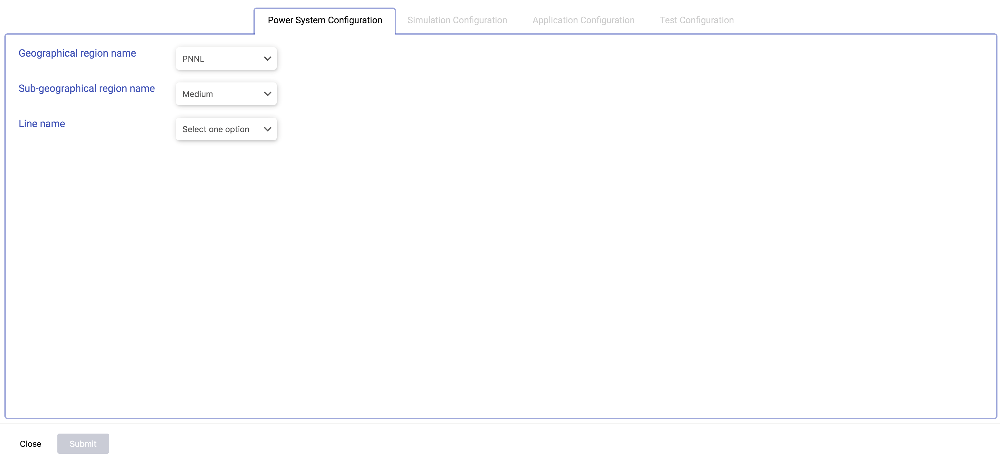
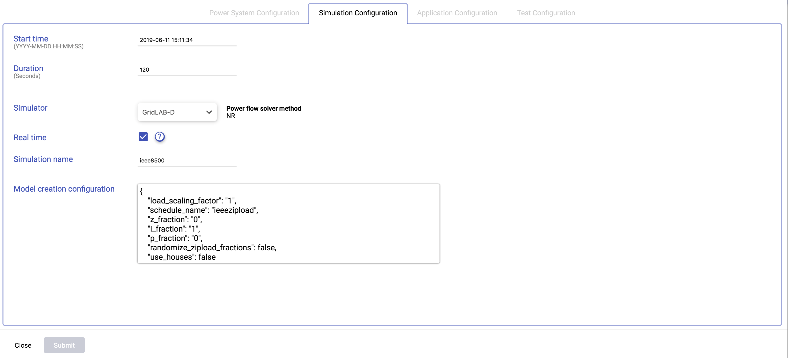
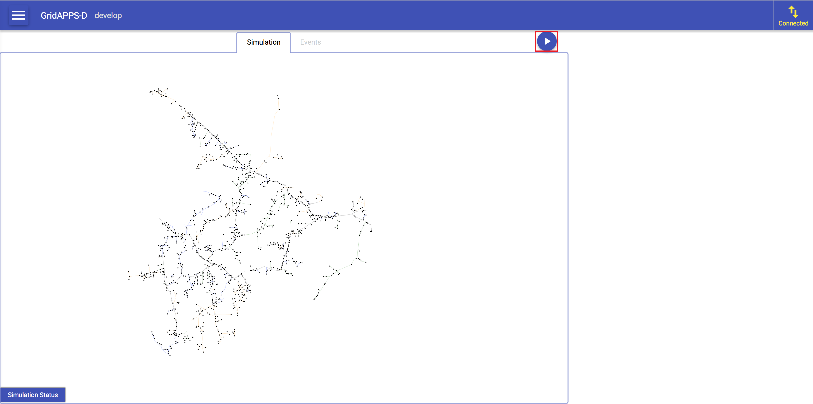
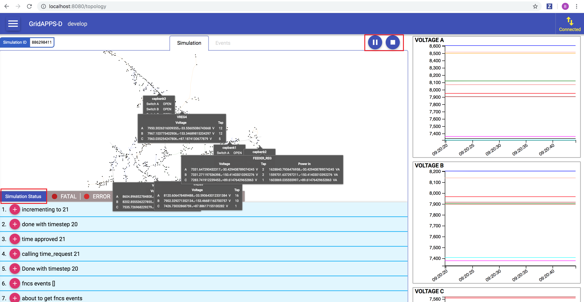
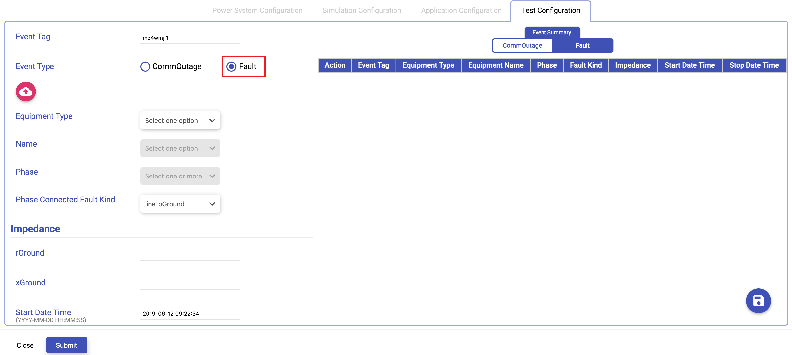
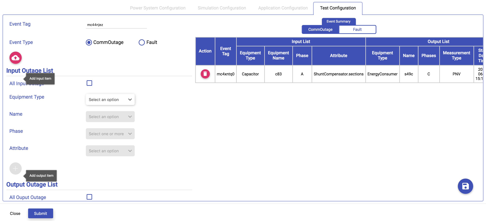

Start GridAPPS-D platform
-------------------------

Connect to the running GridAPPS-D container

.. code-block:: bash

  user@foo>docker exec -it gridappsddocker_gridappsd_1 bash

..

Now we are inside the executing container. Start the platform.

.. code-block:: bash

  root@737c30c82df7:/gridappsd# ./run-docker.sh

..

Open your browser to http://localhost:8080/ and click the menu button.

.. figure:: home.png
    :align: left
    :alt: home-image
    :figclass: align-left
    

Start a Simulation
------------------

Choose Simulations from the menu.

.. figure:: simulation.png
    :align: left
    :alt: menu-image
    :figclass: align-left

To run a demo simulation keep the selected and entered values as it is. Otherwise select/enter Powergrid, Simulation and Application configuration values. 
Click the submit button to save the configuration.

.. figure:: config3.png
    :align: left
    :alt: config-image
    :figclass: align-left

Click the triangle to start the simulation. 

The demo simulation runs 2 minutes of load variations with the sample-app 
controlling capacitor banks on the IEEE 8500-node test system [CIT2]_.  
Most of Figure 1 is devoted to a map layout view of the test circuit, with updated 
labels for capacitor banks and voltage regulators.  On the right-hand side, strip 
chart plots of the phase ABC voltages at capacitors and regulators, phase 
ABC substation power levels, and phase ABC regulator taps are continually 
updated.  Capacitor bank labels on the circuit map view change between 
OPEN and CLOSED to show the bank status as load varies and the VVO 
application issues control commands.  While GridAPPS-D runs the demo, 
GridLAB-D [CIT8]_ simulates power system operation and exchanges 
information with the sample-app using GOSS [CIT6]_ and FNCS [CIT7]_.

Following image shows the demo simulation output of the sample-app running on the IEEE 8500-node test system.
Simulation Status at the bottom of the screen will display the simulation log messages. The simulation can be paused or stopped using the play and stop button.

|rc3_overview_image0|

Stop GridAPPS-D platform
------------------------

For an orderly shutdown of the platform:
  
.. code-block:: bash

  Use Ctrl+C to stop gridappsd from running

Adding Events
-------------

Communication outage and fault events can be added using the Test Configuration page

Select the CommOutage radio button for adding Communication Outage Events

.. figure:: test_config.png
    :align: left
    :alt: config-image
    :figclass: align-left

Select the Fault radio button for adding Fault Events

Added events can be viewed in a tabular format on the right side of the page

The added events for a simulation can be seen in the events view

.. figure:: event_view.png
    :align: left
    :alt: config-image
    :figclass: align-left