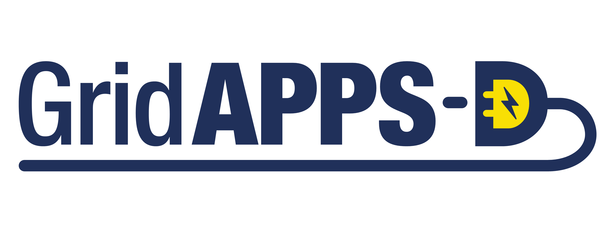

 .. GridAPPS-D

================================================
GridAPPS-D Platform, API, and App Documentation
================================================

GridAPPS-D™ is an open-source platform that accelerates development and deployment of portable applications for advanced distribution management and operations. It is built in a linux environment using Docker, which allows large software packages to be distributed as containers. 

Its purpose is to reduce the time and cost to integrate advanced functionality into distribution operations, to create a more reliable and resilient grid.

GridAPPS-D enables standardization of data models, programming interfaces, and the data exchange interfaces for:

 * devices in the field
 * distributed apps in the systems
 * applications in the control room

The platform provides

 * robust testing tools for applications 
 * distribution system simulation capabilities
 * standardized research capability
 * reference architecture for the industry
 * application development kit

The GridAPPS-D source code is publically available from `GitHub <https://github.com/GRIDAPPSD>`_. The GridAPPS-D™ project is sponsored by the U.S. Department of Energy and receives ongoing updates from a team of core developers at PNNL. 

The GridAPPS-D team encourages and appreciates community involvement, including issues and pull requests on GitHub, participation in monthly app developers meetings, and posts on the discussion board.

Questions and support requests should be filed in the `GridAPPS-D Forum Discussion Board <https://github.com/GRIDAPPSD/gridappsd-forum/discussions>`_

General issues and bugs can be reported in the `GridAPPS-D Forum Issues Page <https://github.com/GRIDAPPSD/gridappsd-forum/issues>`_

Bugs in the GridAPPS-D platform can be reported in full detail using the `GOSS-GridAPPS-D Issues Page <https://github.com/GRIDAPPSD/GOSS-GridAPPS-D/issues>`_

.. toctree::
   :caption: Installation & Runtime
   :maxdepth: 2

   installation/windows10/index
   installation/ubuntu_linux/index
   installation/macos/index
   installation/1.4-Running-GridAPPS-D
   installation/1.5-Using-GridAPPS-D-Viz
   installation/1.6-Docker-Shortcuts
   installation/1.7-Cloud-Server-Configuration
   installation/1.8-Platform-Release-History
   installation/1.9-Known-VPN-Proxy-Issues

.. toctree::
   :caption: GridAPPS-D Overview
   :maxdepth: 2

   overview/2.1-Intro-to-GridAPPS-D
   overview/2.2-GridAPPS-D-Architecture
   overview/2.3-GridAPPS-D-Python-Library
   overview/2.4-GridAPPS-D-Application-Structure
   overview/2.5-GridAPPS-D-Service-Structure
   overview/2.6-Common-Information-Model

.. toctree::
   :caption: GridAPPS-D API Usage
   :maxdepth: 2

   api_usage/3.1-API-Communication-Channels
   api_usage/3.2-API-Message-Structure
   api_usage/3.3-Using-the-PowerGrid-Models-API
   api_usage/3.4-Using-the-Configuration-File-API
   api_usage/3.5-Creating-Running-Simulation-API
   api_usage/3.6-Controlling-Simulation-API
   api_usage/3.7-Using-the-Timeseries-API
   api_usage/3.8-Using-the-Logging-API

.. toctree::
   :caption: GridAPPS-D Applications
   :maxdepth: 2

   applications/restoration-WSU/source/index.rst
   applications/VVO-WSU/README.md
   applications/DER-dispatch-NREL/README.md
   applications/solar-forecast-NREL/README.md
   applications/grid-forecast-NREL/README.md

.. toctree::
   :caption: GridAPPS-D Services
   :maxdepth: 2

   services/dnp3/source/index.rst
   services/sensor-simulator/source/index.rst
   services/voltage-violation/README.md
   services/state-estimator/README.md
   services/ieee2030_5/README.md
   services/alarms/README.md
   

   
Indices and tables
==================

* :ref:`genindex`
* :ref:`modindex`
* :ref:`search`

